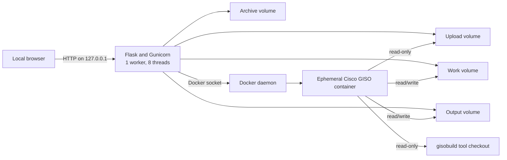

# Architecture Review

## Scope and requirements

This project is a trusted, single-user tool for building Cisco IOS XR Golden ISO
and USB artifacts on one Docker host. Its priorities are safe handling of large
licensed inputs, isolation of the Cisco build process, reproducible local
operation, and retention of verified outputs for no more than 30 days or 50 GiB.
It is not designed as an internet-facing or horizontally scaled service.

## System overview

The browser uploads files in bounded chunks. Flask validates and stores them in
the upload volume, constructs an argument-vector command, and asks the Docker
daemon to run an ephemeral Cisco build container. Successful ISO and USB outputs
are copied into the archive, verified with SHA-256, and exposed for download.

## What is working well

- Child processes use argument arrays instead of shell interpolation.
- The Cisco build container never receives the Docker socket.
- Input and tool mounts are read-only; work and output mounts are dedicated.
- Upload, extraction, member-count, log, retention, and archive-size limits are
  explicit and tested.
- Tar traversal, links, unsafe artifact paths, cross-site mutations, and invalid
  host headers are rejected.
- One build at a time matches the host and workload constraints and prevents
  accidental resource contention.
- Upload creation, build creation, and cleanup transitions are serialized so a
  build cannot observe a partially extracted archive or race with cleanup.
- Tar extraction checks both declared expanded size and reserved free space
  before writing extracted members.
- Artifacts are verified before source cleanup, preserving diagnostic inputs on
  failure.

## Risks and recommendations

### High: Docker socket is a host-administration boundary

Anyone who can control this application can indirectly ask a privileged Docker
daemon to create containers. Localhost binding and host/origin checks reduce
exposure, but they are not authentication.

**Recommendation:** Keep the current local-only deployment. If remote or
multi-user access becomes a requirement, place builds behind an authenticated
job service and use a restricted worker runtime instead of mounting the Docker
socket in the web process. TLS and role-based authorization alone do not remove
the socket risk.

### Medium: Active state is process-local

Jobs and upload sessions are dictionaries in one Gunicorn process. Restarting
the container loses progress and cancellation state, and increasing the worker
count would split state between processes.

**Recommendation:** Keep one worker for the current local scope. Before adding
concurrency or high availability, persist jobs in SQLite or PostgreSQL and move
execution to a durable queue-backed worker. Store the child container ID so a
restarted service can reconcile running builds.

### Medium: Cleanup is request-driven

Retention runs on requests at most hourly and whenever the archive is listed.
An idle installation can therefore retain expired artifacts beyond 30 calendar
days until the next request.

**Recommendation:** This is acceptable if “30 days” means removal on next use.
For strict deletion deadlines, add a host-level scheduled cleanup command or a
dedicated maintenance container with the archive volume mounted.

### Medium: Persistent volumes are a single point of failure

Uploads and archives survive container recreation but remain on one Docker host.
There is no backup, replication, or restore verification.

**Recommendation:** Export validated artifacts to approved protected storage
before expiry. Do not back up licensed Cisco content to locations that violate
its distribution terms.

### Low: Health checks cover Docker availability only

The health endpoint confirms access to Docker but does not verify required
mounts, writable capacity, the tool checkout, or archive health.

**Recommendation:** Add a separate readiness endpoint if unattended operation
is introduced. It should validate required paths and minimum free space without
performing destructive writes.

### Low: The Cisco build image identity is mutable

Python packages, the application base image, and the Alpine Docker CLI package
are pinned. The separately pulled Cisco GISO build image still uses a tag, which
can resolve to different content if the publisher republishes it.

**Recommendation:** Record and test approved image digests for controlled
production workflows. Keep Dependabot and `pip-audit` checks for Python updates.

## Scaling decision

Horizontal scaling is intentionally out of scope. GISO builds are CPU-, memory-,
and disk-intensive, while the present state model and single shared volumes
assume one host. The simplest reliable design is the current serialized worker.
If demand exceeds one concurrent build, separate the web/API layer from durable
workers and allocate isolated storage per job rather than adding Gunicorn workers.

## Review outcome

The design is suitable for its stated trusted-local purpose and has strong input
and artifact safety controls. It is not suitable for public exposure, multiple
untrusted users, strict deletion deadlines, or high availability without the
architectural changes described above.
