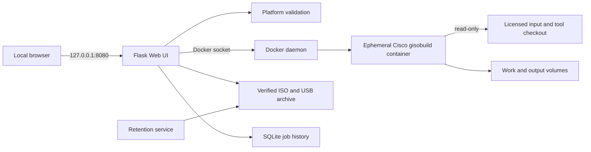

# Architecture Standard — v0.0.1

`v0.0.1` establishes the first documented architecture baseline for the Cisco
IOS XR Golden ISO Builder. It is a local, single-user Docker application and is
not intended to be exposed directly to an untrusted network.

## Architecture baseline

- The Web UI is bound to localhost by default and serializes builds.
- The child Cisco build container does not receive the Docker socket.
- Inputs and the upstream tool checkout are mounted read-only in build jobs.
- Platform validation rejects incompatible eXR and IOS XR7/LNT options early.
- Successful artifacts are copied and SHA-256 verified before source cleanup.
- Job history is persisted in SQLite; active jobs become `interrupted` after a
  Web UI restart.
- A separate service enforces 30-day retention and a 50 GiB combined ISO/USB
  archive limit.

## Included capabilities

- Chunked upload and safe TAR extraction.
- Golden ISO and supported USB boot artifact creation.
- Platform-aware upgrade and rollback guidance.
- Isolated staging rehearsal for workflow ordering.
- CI, security checks, Graphify architecture output, and automated GHCR release
  publication.

## Acceptance evidence

A real NCS5500 25.1.2 build with 12 matching optional RPMs completed with
`ciscogisobuild/cisco-xr-gisobuild:2.3.4`:

- Golden ISO SHA-256: `95f3860b538c689ded4021d13679eb5f04177dc7ba9838f0034d6baae65410e7`
- USB boot ZIP SHA-256: `e4f24b053b38118b7de664155a6a71f2a6726746849f6cdf864c61c54510e0cc`

No Cisco software or generated GISO artifact is included in this release.

## Security and operational limits

The Docker socket is a host-administration boundary. Keep the application local
and trusted. This release does not provide authentication, multi-user isolation,
high availability, running-job reattachment, or hardware upgrade validation.

Use only properly licensed Cisco software and verify the exact platform,
release, PID inventory, supported upgrade path, backups, console access, and
rollback procedure before changing a router. The software is provided without
warranty; operators remain responsible for its use.

See [`ARCHITECTURE.md`](https://github.com/patricklind/gisobuild-gui/blob/v0.0.1/ARCHITECTURE.md)
and the
[`GISOBUILD-GUIDE.md`](https://github.com/patricklind/gisobuild-gui/blob/v0.0.1/GISOBUILD-GUIDE.md)
for the full baseline.
